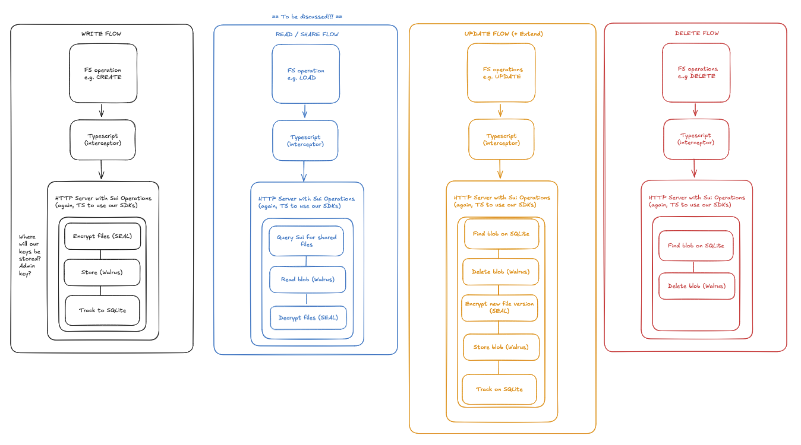

# walrusfs-fuse

**A decentralized filesystem for Linux (and macOS)** -- drop files into a virtual drive, and they're automatically encrypted, stored on [Walrus](https://www.walrus.xyz/), and secured by [Sui](https://sui.io/).

**FUSE** · **Seal** · **Walrus** · **Sui**

Drop files into a mounted drive. They get encrypted, stored on Walrus, and managed on Sui. Or use the web UI to browse and download shared files from the browser.

```
cp report.pdf ~/walrusfs/
# -> Seal encrypts -> Walrus stores -> Sui controls access
```

## Demo

<!-- TODO: embed demo video -->

## How It Works



### The Pipeline

| Step | What happens | Tech |
|------|-------------|------|
| **Drop a file** | FUSE intercepts writes; on file close, content is encrypted and uploaded | `fuse-native` (Node addon) |
| **Encrypt** | Seal threshold encryption with on-chain access policy | `@mysten/seal` |
| **Store** | Encrypted blob uploaded to Walrus decentralized storage | `@mysten/walrus` |
| **Track** | File metadata (name, blob ID, size) saved locally | `bun:sqlite` |
| **Share** | Owner grants access on-chain, publishes encrypted manifest | Move smart contract |

### Sharing Model

**Alice** (file owner):
1. Files are encrypted and stored via the FUSE mount
2. Grants Bob access: `grant_access(registry, bob_address)` on-chain
3. Publishes a manifest of shared files to Walrus

**Bob** (recipient):
1. Connects wallet via web UI
2. Finds Alice's manifest on-chain, downloads file listing from Walrus
3. Downloads and decrypts individual files via Seal

## Tech Stack

| Layer | Technology | Role |
|-------|-----------|------|
| Filesystem | `libfuse` + [`fuse-native`](https://github.com/fuse-friends/fuse-native) | Virtual drive mount |
| Runtime | [Bun](https://bun.sh/) (server) + Node/tsx (FUSE) | Two-process architecture |
| Encryption | [Seal](https://www.npmjs.com/package/@mysten/seal) | Threshold encryption with on-chain policy |
| Storage | [Walrus](https://www.walrus.xyz/) | Decentralized blob storage |
| Blockchain | [Sui](https://sui.io/) | Access control + file registry |
| Database | `bun:sqlite` | Local file tracking |

## Quick Start

### Prerequisites

- **Linux** with `libfuse-dev` (or **macOS** with [macFUSE](https://osxfuse.github.io/))
- **Bun** >= 1.1 and **Node.js** >= 18
- **Sui CLI** (for contract compilation only)
- Two funded Sui testnet wallets (admin + user) with both SUI and WAL tokens

### Setup

```bash
# Install dependencies
cd app && bun install

# Configure environment
cp .env.example .env
# Edit .env with your keys:
#   ADMIN_PRIVATE_KEY=suiprivkey1q...
#   USER_PRIVATE_KEY=suiprivkey1q...
#   PACKAGE_ID=0x...
#   REGISTRY_ID=0x...

# Type-check
bun run build

# Start the drive (mounts at ~/walrusfs)
bun run start
```

### Other Commands

```bash
bun run start:server       # HTTP server only (no FUSE mount)
bun run start:fuse         # FUSE client only (needs server running)
bun run codegen            # Regenerate TS bindings from Move contract
bun run test               # Integration tests (requires .env with keys)
```

## Smart Contract

A single shared `Registry` object on Sui with two tables:

- **Allowlists** -- per-owner sets of addresses authorized to decrypt files
- **Manifests** -- per-owner Walrus blob IDs pointing to shared file listings

The `seal_approve` function acts as the Seal callback: it verifies the encryption namespace, extracts the owner address, and checks the caller is on the allowlist.

## Project Structure

```
walrus-hackathon-mar-2026/
├── contract/                  # Move smart contract (Sui)
│   ├── Move.toml
│   └── sources/
│       └── walrus_drive.move  # Seal policy, file metadata, access control
├── app/                       # TypeScript FUSE daemon + client
│   ├── src/
│   │   ├── index.ts           # Entry point — mount FUSE, start daemon
│   │   ├── fuse.ts            # FUSE ops (read/write/readdir/stat)
│   │   ├── db.ts              # SQLite local cache for fast file tree lookups
│   │   ├── walrus.ts          # Upload/download encrypted blobs to Walrus
│   │   ├── seal.ts            # Encrypt before upload, decrypt after download
│   │   └── sui.ts             # Read/write file metadata objects on Sui
│   └── scripts/
│       └── seed.ts        # Seed script — populates on-chain + Walrus data
├── web/                       # Next.js web UI
│   └── app/
│       ├── page.tsx            # Entry page
│       ├── components/
│       │   ├── SharedFilesPage.tsx  # Main file browser UI
│       │   ├── Providers.tsx        # dapp-kit + React Query providers
│       │   └── ConnectWallet.tsx    # Wallet connection button
│       └── lib/
│           ├── seal.ts         # Browser Seal decrypt (session keys)
│           ├── sharing.ts      # Registry discovery (manifests, allowlists)
│           ├── walrus.ts       # Download blobs via aggregator proxy
│           └── constants.ts    # Env var exports
```

## How Components Work

| Component | What it does |
|-----------|-------------|
| **contract/** | Move package on Sui — defines a **Seal encryption policy** that controls who can encrypt/decrypt files |
| **app/src/fuse.ts** | Translates Finder/shell actions (open, read, write, ls) into Walrus uploads/downloads + SQLite cache updates |
| **app/src/db.ts** | SQLite — caches the file tree locally so `ls` and `stat` are instant without hitting the chain |
| **app/src/walrus.ts** | Talks to the Walrus network — stores and retrieves encrypted file blobs |
| **app/src/seal.ts** | Wraps Seal SDK — encrypts plaintext before upload, decrypts ciphertext after download, using the on-chain policy |
| **app/src/sui.ts** | Sui client — creates/updates/deletes `FileEntry` objects on-chain so the file registry stays in sync |
| **web/** | Next.js browser UI — connects wallet, discovers files from on-chain Registry, decrypts Seal-encrypted blobs on download |

## Running the Web UI

### Prerequisites

- Node.js 18+
- A deployed contract (you need `PACKAGE_ID` and `REGISTRY_ID`)

### 1. Install dependencies

```bash
cd web
npm install
```

### 2. Configure environment

Create `web/.env.local`:

```env
NEXT_PUBLIC_PACKAGE_ID=0x<your-package-id>
NEXT_PUBLIC_REGISTRY_ID=0x<your-registry-id>
NEXT_PUBLIC_NETWORK=testnet
NEXT_PUBLIC_WALRUS_AGGREGATOR_URL=https://aggregator.walrus-testnet.walrus.space
```

### 3. Start the dev server

```bash
cd web
npm run dev
```

Open [http://localhost:3000](http://localhost:3000), connect your Sui wallet, and you'll see your files.

## Seed Script

The seed script populates the on-chain Registry and Walrus with test data so the web UI has files to display.

**What it does:**
1. Registers the admin in the Registry (creates allowlist)
2. Grants access to a user address
3. Encrypts test files with Seal
4. Uploads encrypted blobs to Walrus
5. Builds a JSON manifest and uploads it to Walrus
6. Publishes the manifest blob ID on-chain

### Configure

Make sure `app/.env` has:

```env
ADMIN_PRIVATE_KEY=suiprivkey1...
USER_PRIVATE_KEY=suiprivkey1...
PACKAGE_ID=0x...
REGISTRY_ID=0x...
NETWORK=testnet
```

### Run

```bash
cd app
bun run scripts/seed.ts
```

Or with a custom user address:

```bash
bun run scripts/seed.ts --user-address=0xABC...
```

## Testing

Integration tests run against Sui testnet and cover the full pipeline:

```bash
bun run test
```

1. Publish contract
2. Create allowlist + add user
3. Upload/download blob via Walrus
4. Encrypt via Seal
5. Upload encrypted blob + publish manifest
6. Decrypt as authorized user

## Built With

Built for the [Walrus Hackathon](https://www.walrus.xyz/) (March 2026).
